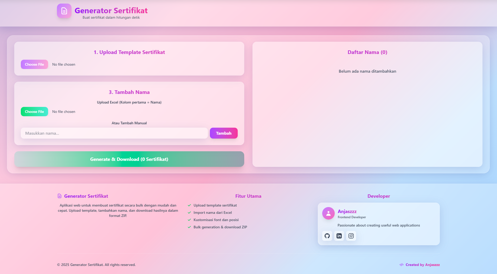

# Certificate Generator

<div align="center">


**Aplikasi web modern untuk membuat sertifikat secara bulk dengan mudah dan cepat**

[Fitur](#-fitur) • [Demo](#-demo) • [Instalasi](#-instalasi) • [Penggunaan](#-penggunaan) • [Teknologi](#-teknologi-yang-digunakan) • [Kontribusi](#-kontribusi)

</div>

---

## Tentang Project

**Certificate Generator** adalah aplikasi web yang memungkinkan Anda membuat ratusan sertifikat dalam hitungan detik! Cukup upload template sertifikat, tambahkan daftar nama (via Excel atau manual), atur posisi dan style teks, lalu download semua sertifikat dalam format ZIP.

Aplikasi ini sangat cocok untuk:
- Event organizer yang perlu membuat sertifikat untuk peserta
- Institusi pendidikan yang membuat sertifikat kelulusan
- Workshop atau training yang perlu sertifikat untuk partisipan
- Siapa saja yang membutuhkan sertifikat dalam jumlah banyak

---

## Fitur

### Upload Template
- Upload template sertifikat dalam format gambar (PNG, JPG, JPEG)
- Preview template secara real-time

### Kelola Nama
- **Import dari Excel**: Upload file Excel (.xlsx, .xls) dengan kolom pertama berisi nama
- **Input Manual**: Tambahkan nama satu per satu secara manual
- **Kelola Daftar**: Hapus nama yang tidak diperlukan dari daftar

### Kustomisasi Teks
- **Posisi**: Atur posisi horizontal dan vertical dengan slider
- **Ukuran Font**: Sesuaikan ukuran font (20px - 400px)
- **Jenis Font**: Pilih dari 15+ font profesional (Poppins, Arial, Times New Roman, dll)
- **Ketebalan Font**: 9 pilihan ketebalan (Thin, Light, Normal, Medium, Bold, dll)
- **Warna Font**: Color picker untuk memilih warna yang sesuai
- **Preview Live**: Lihat hasil perubahan secara real-time

### Generate & Download
- **Multi Format Output**: PNG, JPG, JPEG, atau PDF
- **Bulk Generation**: Generate semua sertifikat sekaligus
- **Auto ZIP**: Download otomatis dalam format ZIP
- **Progress Indicator**: Monitor proses generation

### UI/UX Modern
- **Responsive Design**: Bekerja sempurna di desktop, tablet, dan mobile
- **Glass Morphism**: Design modern dengan efek glassmorphism
- **Gradient Pastel**: Warna-warna soft yang nyaman di mata
- **Smooth Animations**: Transisi dan animasi yang halus

---

## Demo

### Screenshot

**Interface Utama**




### Workflow
1. Upload template sertifikat
2. Atur posisi dan style teks menggunakan live preview
3. Import nama dari Excel atau tambah manual
4. Pilih format output (PNG/JPG/PDF)
5. Klik "Generate & Download"
6. Dapatkan file ZIP berisi semua sertifikat

---

## Instalasi

### Prerequisites
- Node.js (v16 atau lebih tinggi)
- npm atau yarn

### Clone Repository
```bash
git clone https://github.com/Anjaszz/generate-sertif.git
cd generate-sertif
```

### Install Dependencies
```bash
npm install
```

### Jalankan Development Server
```bash
npm run dev
```

Aplikasi akan berjalan di `http://localhost:5173`

### Build untuk Production
```bash
npm run build
```

Output akan tersimpan di folder `dist/`

### Preview Production Build
```bash
npm run preview
```

---

## Penggunaan

### 1. Persiapan Template
Siapkan template sertifikat dalam format gambar (PNG/JPG). Pastikan area untuk nama sudah jelas dan terlihat.

### 2. Upload Template
Klik tombol "Choose File" di bagian "Upload Template Sertifikat" dan pilih file template Anda.

### 3. Atur Posisi & Style Teks
- Gunakan slider **Posisi Horizontal** dan **Posisi Vertical** untuk mengatur letak nama
- Sesuaikan **Ukuran Font** sesuai kebutuhan
- Pilih **Jenis Font** dan **Ketebalan Font**
- Pilih **Warna Font** menggunakan color picker
- Pilih **Format Output** (PNG, JPG, JPEG, atau PDF)
- Gunakan **Preview Live** untuk melihat hasil perubahan

### 4. Tambahkan Nama

**Opsi A: Import dari Excel**
- Siapkan file Excel dengan nama-nama di kolom pertama
- Klik "Choose File" di bagian "Upload Excel"
- Semua nama akan otomatis ditambahkan ke daftar

**Opsi B: Input Manual**
- Ketik nama di input field
- Tekan Enter atau klik tombol "Tambah"

### 5. Generate & Download
- Review daftar nama di panel kanan
- Klik tombol **"Generate & Download (X Sertifikat)"**
- Tunggu proses generation selesai
- File ZIP akan otomatis terdownload

### 6. Extract & Gunakan
- Extract file ZIP yang sudah didownload
- Semua sertifikat sudah siap dengan format: `sertifikat_[nama].[format]`

---

## Format File Excel

Struktur file Excel yang benar:

| A (Nama)       | B (Optional) | C (Optional) |
|----------------|--------------|--------------|
| John Doe       |              |              |
| Jane Smith     |              |              |
| Robert Johnson |              |              |
| Maria Garcia   |              |              |

**Catatan:**
- Kolom pertama (A) harus berisi nama
- Baris pertama akan diabaikan (dianggap header)
- Kolom lain akan diabaikan
- Format: .xlsx atau .xls

---

## Teknologi yang Digunakan

### Core Framework
- **React 19** - Library UI modern dan reaktif
- **TypeScript** - Type safety dan better developer experience
- **Vite** - Build tool yang super cepat

### Styling
- **Tailwind CSS 4** - Utility-first CSS framework
- **Custom CSS** - Glassmorphism effect dan animasi

### Libraries
- **xlsx** - Untuk membaca file Excel
- **jsPDF** - Generate PDF dari canvas
- **JSZip** - Membuat file ZIP untuk bulk download
- **Canvas API** - Rendering sertifikat dengan teks custom

### Development Tools
- **ESLint** - Linting untuk code quality
- **TypeScript ESLint** - Type checking
- **Vite Plugin React** - Fast refresh dan optimasi

---

## Struktur Project

```
certificate-generator/
├── public/
│   └── logo.png              # Logo aplikasi
├── src/
│   ├── App.tsx               # Component utama aplikasi
│   ├── App.css               # Custom styles
│   ├── main.tsx              # Entry point
│   └── viewScript.js         # Helper scripts
├── index.html                # HTML template
├── package.json              # Dependencies
├── tsconfig.json             # TypeScript config
├── vite.config.ts            # Vite config
├── tailwind.config.js        # Tailwind config
└── README.md                 # Dokumentasi ini
```

---

## Fitur Mendatang

- [ ] Multiple text fields (nama, tanggal, nomor sertifikat, dll)
- [ ] Template gallery dengan templates siap pakai
- [ ] Custom fonts upload
- [ ] QR Code generation untuk verifikasi
- [ ] Database untuk menyimpan history
- [ ] Batch processing untuk ribuan sertifikat
- [ ] Export ke Google Drive / Dropbox
- [ ] Email automation untuk kirim sertifikat

---

## Kontribusi

Kontribusi sangat welcome! Jika Anda ingin berkontribusi:

1. Fork repository ini
2. Buat branch baru (`git checkout -b feature/AmazingFeature`)
3. Commit perubahan (`git commit -m 'Add some AmazingFeature'`)
4. Push ke branch (`git push origin feature/AmazingFeature`)
5. Buat Pull Request

---

## Troubleshooting

### Sertifikat tidak ter-generate
- Pastikan template sudah di-upload
- Pastikan minimal ada 1 nama di daftar
- Cek console browser untuk error message

### Nama tidak terbaca dari Excel
- Pastikan nama ada di kolom pertama (kolom A)
- Pastikan format file .xlsx atau .xls
- Pastikan tidak ada baris kosong di awal

### Preview tidak muncul
- Refresh browser
- Pastikan template gambar valid
- Cek ukuran gambar (max 10MB recommended)

### Font tidak berubah
- Beberapa font memerlukan internet connection
- Pastikan font Poppins sudah ter-load dari Google Fonts
- Untuk custom font, gunakan font yang sudah terinstall di sistem

---

## License

Project ini menggunakan lisensi MIT. Lihat file `LICENSE` untuk detail lengkap.

---

## Author

**Anjaszzz**
- Website: [anjasrani.my.id](https://anjasrani.my.id)
- GitHub: [@Anjaszz](https://github.com/Anjaszz)
- LinkedIn: [Anjas Rani](https://www.linkedin.com/in/anjas-rani-562396212)
- Instagram: [@anjaszz_](https://www.instagram.com/anjaszz_/)

---

## Acknowledgments

- Terimakasih kepada komunitas open source
- Icons dari Heroicons
- Fonts dari Google Fonts
- Inspirasi dari berbagai certificate generator tools

---

<div align="center">

**Made with by Anjas Rani**

Jika project ini membantu Anda, jangan lupa kasih star Yaa

</div>
